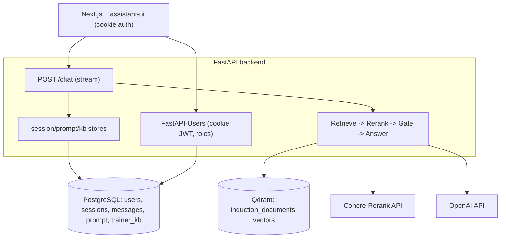

# Induction Chatbot — System Blueprint (M1)

Purpose of this document: enough detail that a capable agent (Opus 4.8) can reproduce the M1 system closely from scratch. It captures the product expectations, the bug we target (Bug1), the architecture, the data model, every endpoint, the retrieval pipeline with exact constants, and the frontend. Conventions: Python backend with readable code and NO code comments; numbered lists; one best choice per decision.

## 1. Product summary
A fast, concise, ChatGPT-like assistant for new Wimmera CMA employees. It answers strictly from a curated knowledge base (induction documents + trainer-added knowledge), keeps per-session and lightweight cross-session memory, cites its sources, and asks a clarifying question instead of guessing. Overriding requirement: reliability — never confidently answer when unsure.

## 2. M1 expectations (the contract)
1. Reliability is uncompromisable (budget may be spent for it).
2. Never guess / hallucinate; when unsure, say so or ask a clarifying question.
3. Simple registration/sign-in restricted to `@wcma.vic.gov.au` emails.
4. Users see their past sessions (ChatGPT-style thread list).
5. Remember past sessions in summarised form (lightweight).
6. Admin panel: view users + their conversations, reset passwords, promote to trainer.
7. Roles: basic and trainer (plus admin).
8. All users basic by default; admin can promote to trainer.
9. Trainer knowledge enters the KB two ways: an "Add to KB" button on a message, and trainer document upload (PDF/DOCX/TXT). Provenance stored; live immediately; admin can audit/remove.
10. Admin can view + edit the system prompt; saving reconfigures the bot at runtime.
11. Cite the source (document + section/page); say when an answer came from trainer-added knowledge.
12. Never answer on lexical match alone (Bug1).

## 3. Bug1 (the target failure)
Asked whether a 12:00-12:30 lunch counts as time worked, the old chunk-RAG bot answered from the conditional Emergency-work appendix (applies only under AIIMS incident control) and missed the governing general clause (~23.3: no more than 5 consecutive hours without a break). Root cause: top-k vector similarity retrieved the lexically-similar appendix and never surfaced/respected the governing clause. The fix is a retrieval pipeline that maximises recall of the governing clause, reranks by true relevance, tags conditional scope, and gates on confidence — plus a system prompt that reasons about which clause governs.

## 4. Stack (pinned)
1. LLM + embeddings: OpenAI `gpt-4o-mini` (chat), `text-embedding-3-small` (embeddings), via LlamaIndex.
2. Reranker: Cohere Rerank (`rerank-english-v3.0`), via `llama-index-postprocessor-cohere-rerank==0.9.0` + `cohere==6.1.0`. Chosen over a local cross-encoder because the prod backend container is capped at 512M; rerank compute is offloaded.
3. Vector store: Qdrant `v1.12.5`, collection `induction_documents`.
4. Relational DB: PostgreSQL 16, via SQLAlchemy `2.0.51` async + `asyncpg==0.31.0` (+ `greenlet`).
5. Auth: `fastapi-users[sqlalchemy]==15.0.5` (+ `fastapi-users-db-sqlalchemy==7.0.0`), cookie + JWT.
6. Backend: FastAPI `0.115.6`, uvicorn; `pydantic-settings`; `pymupdf` (PDF), `python-docx` (DOCX), `python-multipart` (uploads).
7. Frontend: Next.js 16 (App Router) + React 19 + assistant-ui (`@assistant-ui/react`), Tailwind v4.
8. Packaging: Docker + Docker Compose (services: app/backend, frontend, qdrant, postgres).

## 5. Architecture

Request flow for `/chat` (per turn):
1. Auth dependency resolves the current user from the cookie JWT (401 if absent).
2. Open an async DB session. Get-or-create the `ChatSession` by `(user_id, client_key)` where `client_key` is the frontend `session_id`.
3. Load that session's message history from Postgres into a list of LlamaIndex `ChatMessage`.
4. Build cross-session context = bullet list of OTHER sessions' summaries for this user (most recent 10).
5. Load the system prompt from DB config (falls back to the default).
6. Stream the answer (see pipeline), running the blocking generation in a threadpool (`starlette.concurrency.iterate_in_threadpool`) so the event loop is not blocked.
7. After streaming: persist the user + assistant messages; regenerate this session's summary (threadpool LLM call) and store it.

## 6. Retrieval pipeline (the Bug1 fix) — exact behaviour
Module `app/rag/retrieval.py` and `app/rag/chat.py`. Constants:
- `CANDIDATES_BEFORE_RERANK = 20` (dense top-k from Qdrant).
- `PASSAGES_AFTER_RERANK = 8` (Cohere `top_n`).
- `RELEVANCE_FLOOR = 0.30` (confidence gate on the top reranked score).
- Ingestion chunking: `SentenceSplitter(chunk_size=700, chunk_overlap=150)`.

Steps in `answer_stream(system_prompt, history, cross_session_context, message)`:
1. Condense: if there is history, rewrite the latest message into a standalone question via one `llm.complete` call (so follow-ups retrieve correctly).
2. Retrieve: dense vector search, top 20 candidates from Qdrant.
3. Rerank: Cohere cross-encoder reorders candidates by true relevance; keep top 8 with scores.
4. Gate: if no passages or `passages[0].score < RELEVANCE_FLOOR`, stream the UNSURE response (clarify + point to manager/People & Culture) and stop. This enforces "no guessing".
5. Build messages: `[system prompt]`, optional `[system: cross-session context]`, `[system: source passages with citation labels]`, `[...history...]`, `[user message]`.
6. Stream the answer from `gpt-4o-mini`.

## 7. Ingestion + scope tagging (`app/ingest.py`)
1. PDF: PyMuPDF, page-level `Document`s with metadata `{source, page, scope}`.
2. DOCX: heading-aware. Walk paragraphs; a paragraph whose style starts with "Heading" (or "Title") starts a new section; emit one `Document` per section with metadata `{source, section, scope}`; tables appended as a "Tables" section.
3. Scope tag: `detect_scope(text)` returns `"emergency-only"` if the text contains any of `["AIIMS", "incident control", "incident management team"]`, else `"general"`. Surfaced in the citation label as "(conditional: emergency / AIIMS incident control only)" so the model knows not to apply it to ordinary questions.
4. Ingestion clears the collection then re-ingests (clean, no stale vectors), chunking via `SentenceSplitter(700/150)`. Metadata propagates to chunks.

## 8. Citations (`citation_label` in `app/rag/chat.py`)
- Trainer origin -> `"{source} (trainer-provided)"`.
- PDF -> `"{source}, p.{page}"`; DOCX -> `"{source}, section: {section}"`.
- emergency-only scope appends the conditional note.
- The system prompt instructs the model to cite every substantive claim using these labels and to state when info is trainer-provided.

## 9. Memory model
- Within a session: full message history loaded from Postgres each turn (not an in-process buffer).
- Cross-session (lightweight): each `ChatSession` has a `summary` (2-3 sentences), regenerated after each turn from the running transcript. On a new turn, the other sessions' summaries are concatenated and injected as a system message labelled as background context that must not override the source passages.

## 10. Data model (PostgreSQL, tables created via SQLAlchemy `create_all` on startup)
- `user` (FastAPI-Users base UUID table) + extra columns: `full_name: str`, `role: str` (`basic`|`trainer`|`admin`, default `basic`), `profile_summary: text`.
- `chat_session`: `id uuid pk`, `user_id uuid fk user.id`, `client_key str`, `title str`, `summary text`, `created_at`, `updated_at`; unique `(user_id, client_key)`.
- `chat_message`: `id uuid pk`, `session_id uuid fk chat_session.id`, `role str` (`user`|`assistant`), `content text`, `created_at`.
- `system_prompt_config`: single row `id=1`, `prompt text`, `updated_at`. Seeded with the default prompt on startup.
- `trainer_kb_entry`: `id uuid pk`, `trainer_id uuid fk user.id`, `trainer_name str`, `kind str` (`message`|`document`), `source_label str`, `filename str`, `content text`, `created_at`.

## 11. Auth (`app/auth.py`, `app/schemas.py`, `app/seed_admin.py`)
1. FastAPI-Users with `SQLAlchemyUserDatabase`. JWT strategy, `CookieTransport` (httpOnly, SameSite=Lax, `cookie_secure` from env), token lifetime 7 days.
2. Registration domain restriction: `UserManager.create` rejects emails whose domain != `ALLOWED_EMAIL_DOMAIN` (`wcma.vic.gov.au`) with 400.
3. Role guards: `current_active_user`; `require_roles(*roles)` returns a dependency that always allows `admin`, else requires membership; `current_trainer = require_roles("trainer")`, `current_admin = require_roles("admin")`.
4. Admin seed: `python -m app.seed_admin` creates/ensures an admin from `ADMIN_EMAIL`/`ADMIN_PASSWORD` (sets `role=admin`, `is_superuser=True`).
5. Password hashing: argon2 via FastAPI-Users `PasswordHelper` (used for admin reset).

## 12. Trainer KB ingestion (`app/trainer_kb.py`, `app/kb_store.py`)
1. `POST /kb/text` (trainer): create a `trainer_kb_entry` (kind=message, source_label="Trainer note by {name}"), then embed the text into Qdrant.
2. `POST /kb/document` (trainer): read upload, extract text (PDF via PyMuPDF stream, DOCX via python-docx BytesIO, TXT decode; else 400), create entry (kind=document, source_label=filename), embed.
3. Embedding: build a LlamaIndex `Document` with `id_ = kb_entry_id` and metadata `{source, origin:"trainer", trainer, scope, kb_entry_id}`, chunk with `SentenceSplitter(700/150)`, `index.insert_nodes(nodes)`. Using `id_` as ref_doc_id lets admin removal delete the entry's vectors via `vector_store.delete(ref_doc_id)`.
4. Blocking embed/extract calls run in a threadpool from the async endpoints.

## 13. Endpoints (all browser calls send `credentials: "include"`)
- Auth: `POST /auth/register`, `POST /auth/jwt/login` (form: username,password), `POST /auth/jwt/logout`, `POST /auth/forgot-password`, `POST /auth/reset-password`; `GET /users/me`.
- Chat (login required): `POST /chat` `{session_id, message}` (text/plain stream); `GET /sessions`; `GET /sessions/{id}/messages`.
- Trainer: `POST /kb/text` `{content}`; `POST /kb/document` (multipart `file`).
- Admin: `GET|PUT /admin/prompt`; `GET /admin/users`; `POST /admin/users/{id}/role` `{role}`; `POST /admin/users/{id}/reset-password` `{new_password}`; `GET /admin/users/{id}/sessions`; `GET /admin/users/{id}/sessions/{sid}/messages`; `GET /admin/kb`; `DELETE /admin/kb/{id}`.
- `GET /health`.
- CORS: allow the frontend origin with `allow_credentials=True`.

## 14. Backend file map
- `app/config.py`: pydantic-settings (OpenAI/Cohere keys + models, qdrant, documents_dir, frontend_origin, database_url, jwt_secret, cookie_secure, allowed_email_domain, admin_email/password).
- `app/db.py`: async engine, `async_session_maker`, `Base`, `create_db_and_tables`, `get_async_session`.
- `app/models.py`: User + ChatSession + ChatMessageRecord + SystemPromptConfig + TrainerKBEntry; role + kind constants.
- `app/auth.py`, `app/schemas.py`, `app/seed_admin.py`: auth.
- `app/rag/engine.py`: configures LlamaIndex LLM + embeddings + Qdrant vector store (`check_compatibility=False`).
- `app/rag/retrieval.py`: index, Cohere reranker, retrieve+rerank, confidence check.
- `app/rag/chat.py`: default system prompt, condense, citation labels, `answer_stream`, `summarise_conversation`.
- `app/ingest.py`: section-aware ingestion + scope tags.
- `app/chat_store.py`, `app/config_store.py`, `app/kb_store.py`, `app/admin_store.py`: async DB helpers.
- `app/trainer_kb.py`: upload extraction + KB embed/remove.
- `app/main.py`: app wiring, lifespan (create tables + seed prompt), routers, all endpoints.
- `app/regression.py`: seeded Bug1 regression (clause-23.3 meal-break case).
- `app/ask.py`: CLI for ad-hoc questions.

## 15. Frontend (Next.js App Router)
- `lib/api.ts`: API base + all fetch wrappers (always `credentials:"include"`); login posts form-urlencoded.
- `lib/trainer-context.tsx`: `TrainerProvider`/`useCanTrain` to gate trainer UI.
- `app/login/page.tsx`: login/register (domain hint), redirects to `/` on success.
- `app/assistant.tsx`: auth gate (`/users/me`, else redirect to `/login`); custom sidebar listing `/sessions` (new chat + reload history); a keyed `ChatPane` building `useLocalRuntime` with a streaming adapter to `/chat`; trainer doc-upload; logout; admin link.
- `components/thread.tsx`: assistant-ui thread; `AddToKbButton` on user messages (trainer-only) posts `/kb/text`.
- `app/admin/page.tsx`: admin-gated panel (users table with role select + reset password + view chats; system prompt editor; KB entries list + delete).
- Citations: rendered inline in the assistant's markdown answer (the model writes the labels); no separate citations widget in M1.

## 16. Environment variables
`OPENAI_API_KEY`, `OPENAI_CHAT_MODEL` (default gpt-4o-mini), `OPENAI_EMBEDDING_MODEL`, `COHERE_API_KEY`, `COHERE_RERANK_MODEL` (rerank-english-v3.0), `QDRANT_URL`, `QDRANT_COLLECTION` (induction_documents), `DOCUMENTS_DIR`, `FRONTEND_ORIGIN`, `DATABASE_URL` (postgresql+asyncpg://...), `JWT_SECRET`, `COOKIE_SECURE` (true in prod), `ALLOWED_EMAIL_DOMAIN` (wcma.vic.gov.au), `ADMIN_EMAIL`, `ADMIN_PASSWORD`. Frontend: `NEXT_PUBLIC_API_URL`.

## 17. Build / run / deploy
Local: `docker compose up -d postgres qdrant`; `pip install -r requirements.txt`; `python -m app.ingest`; `python -m app.seed_admin`; `uvicorn app.main:app`; `cd frontend && npm install && npm run dev`.
Verify Bug1: `python -m app.regression`.
Deploy (AWS EC2, Docker, behind nginx/SSL): add a Postgres service to the server compose, set all env, route ALL backend API paths (`/auth/*`, `/users/*`, `/sessions/*`, `/kb/*`, `/admin/*`, `/chat`) to the backend, then one-off `seed_admin` + `ingest`. See `handover.md` for server specifics.

## 18. Milestone 2 (out of scope for M1, noted for the reproducer)
Auto-refresh ingestion on document upload (change-detection) and robust retrieval for a large KB (hierarchical/structured retrieval) — the reranker pipeline here is the M1-sized step on that path.
