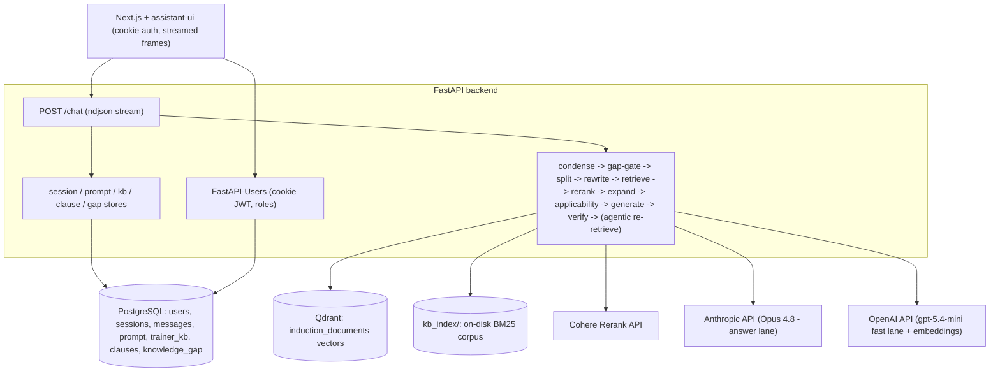

# Induction Chatbot — System Blueprint (final, M1)

Purpose: enough detail that a capable agent (e.g. a new Anthropic model) can reproduce a system equivalent to this one from scratch. It captures the product contract, the bugs we target, the architecture, the exact stack and constants, the data model, every endpoint, the retrieval/generation pipeline, the reliability mechanisms, the deployment, and the actual knowledge-base resources. Conventions: Python backend, readable code, numbered lists, ONE best choice per decision. This file reflects the FINAL configuration (Phases 1–5), superseding any older description.

## 1. Product summary
A fast, concise, ChatGPT-like assistant for new Wimmera CMA employees. It answers STRICTLY from a curated knowledge base (induction documents + trainer-added knowledge), keeps per-session and lightweight cross-session memory, cites its sources, opens with a greeting, can give a short guided tour, and gives helpful overviews. Overriding requirement: reliability — answer only when grounded, but NEVER abstain on something the KB can clearly answer. Live at https://induction.wcma.work/.

## 2. M1 expectations (the contract)
1. Reliability is uncompromisable (budget may be spent for it).
2. Never guess / hallucinate; when unsure, say so — but do not falsely abstain on KB-answerable questions.
3. Simple registration/sign-in restricted to `@wcma.vic.gov.au` emails.
4. Users see their past sessions (ChatGPT-style thread list) and can delete them.
5. Remember past sessions in summarised form (lightweight).
6. Admin panel: view users + their conversations, reset passwords, promote to trainer.
7. Roles: basic and trainer (plus admin).
8. All users basic by default; admin can promote to trainer.
9. Trainer knowledge enters the KB two ways: an "Add to KB" button on a message, and trainer document upload (PDF/DOCX/TXT). Provenance stored; live immediately; admin can audit/remove.
10. Admin can view + edit the system prompt; saving reconfigures the bot at runtime.
11. Cite the source (document + section/page); say when an answer came from trainer-added knowledge.
12. Never answer on lexical match alone (Bug1).

## 3. The two original bugs and the fundamental problem
### Bug1 — lexical-match-over-relevance (the original target)
Asked whether a 12:00–12:30 lunch counts as time worked, the old chunk-RAG bot answered from the conditional Appendix C: Emergency Work (applies only under emergency activation) and missed the governing clause 23 (Rest Breaks / Meal Breaks). The EA is hierarchical: clause 23 (p.28), clause 24 Emergency Response (p.28), Appendix C (p.71). The fundamental problem is NOT emergency-specific: a clause's applicability (emergency-only, casual-only, probation-only, etc.) is set by its place in the heading hierarchy, which naive chunking severs from the chunk text. So no reranker or keyword can reliably know a chunk is conditional.

REJECTED FIX (do not reproduce): a keyword `detect_scope` matching "AIIMS/incident control" plus emergency-specific prompt lines. That patches one case and is a hack.

CORRECT FIX: make every chunk carry its own structural context at ingestion (Anthropic Contextual Retrieval), plus grounded/verified generation, calibrated abstention, and an eval harness. See §6.

### Bug2 — false abstention on coverage/"how many"
The model correctly listed every leave type from the KB MAP, but the verifier graded each item against the RETRIEVED passages only and failed them as "not in source material" → canned abstention ~83% of runs. Fix: the KB MAP is authoritative for EXISTENCE / COVERAGE / ENUMERATION in both generation and verification; SUBSTANTIVE policy facts still require retrieved source material; scope violations stay a hard fail. Re-ingestion does NOT fix Bug2 — it is a verification-scope issue.

## 3b. Knowledge-base resources (the actual documents)
`documents/` (env `DOCUMENTS_DIR=documents`) is organised into PROGRESSIVE CATEGORY folders (`category1`…`categoryN`). `documents/objectives.json` maps each category to a learning objective and is the SOURCE OF TRUTH for which folders are ingested: `list_categorised_documents()` walks only the folders named there (recursively), so any other folder (e.g. a holding `additional/`) and any root-level file are skipped — no hardcoded folder names. The top-level folder a file sits in becomes its `category`.

Six file types are ingested (recursive `rglob`, `~$` temp files skipped), dispatched by suffix in `parse_document`:
1. `.pdf`, `.docx` — structure-aware parse (clause numbers / headings).
2. `.doc` — converted to `.docx` via headless LibreOffice (`soffice --headless --convert-to docx`), then parsed as docx; the original `.doc` filename is kept as the source. Needs LibreOffice (in the backend image; a bare Windows host has none, so those files print `[skip]` and are omitted locally).
3. `.json` — recursively flattened to readable indented text (e.g. the org chart → `name: …` / `children:` tree), one unit; title from the filename.
4. `link_*.txt` — a file holding a single URL; that one page is fetched and its main text extracted with `trafilatura` (no recursion). Dead URL → warn + skip. Source/title derived from the cleaned filename (`link_board_profiles.txt` → "Board Profiles").
5. plain `.txt` — decoded as text, one unit.

The current five categories produce ~446 contextual chunks / ~418 clause rows (the two `.doc` files only when LibreOffice is present). Every chunk and `clause` row carries its `category`; the KB MAP groups documents by category and prints each category's objective. New/edited documents are dropped into the right category folder (and `objectives.json` updated for a new category) and a re-ingest is run.

## 4. Stack (pinned — see `requirements.txt`)
1. LLMs (two lanes, provider-agnostic via `app/llm_factory.py`):
   - **Answer lane** (user-facing reply, strongest model): Anthropic **Claude Opus 4.8** — `LLM_PROVIDER=anthropic`, `ANTHROPIC_CHAT_MODEL=claude-opus-4-8`, `llama-index-llms-anthropic==0.11.4`. Opus 4.8 is unknown to the pinned package and REJECTS `temperature` (adaptive thinking), so the factory registers its context window and adds it to the no-temperature list at runtime. Streamed token-by-token. Per-request timeout 120s, `max_retries=2`.
   - **Fast lane** (every mechanical step): OpenAI **`gpt-5.4-mini`** — `FAST_LLM_PROVIDER=openai`, `FAST_CHAT_MODEL=gpt-5.4-mini`. Seedable/deterministic at `temperature=0` (seed varied per retry). It is a GPT-5 reasoning model, so the factory sets the lowest reasoning effort (`none` for 5.1+ families, `minimal` for the 5.0 family) to keep the yes/no judgements cheap and fast. Chosen over `gpt-4o-mini` because `gpt-4o-mini` has a hard 10k-requests/day Tier-1 cap that we hit in production; GPT-5 models are RPM/TPM-limited only. Per-request timeout 45s, `max_retries=2`.
   - Embeddings: OpenAI `text-embedding-3-small`. Flip `LLM_PROVIDER=openai` to run the answer lane on `OPENAI_CHAT_MODEL` (default `gpt-4o-mini`) too.
2. Reranker: Cohere Rerank (`rerank-english-v3.0`), via `llama-index-postprocessor-cohere-rerank==0.9.0` + `cohere==6.1.0`. Chosen over a local cross-encoder because the prod backend container is capped at 512M; rerank compute is offloaded.
3. Vector store: Qdrant `v1.12.5`, collection `induction_documents`.
4. Lexical index: on-disk BM25 (`rank-bm25==0.2.2`) in `kb_index/` (the contextualised chunk text is what gets BM25-indexed).
5. Relational DB: PostgreSQL 16, via SQLAlchemy `2.0.51` async + `asyncpg==0.31.0` (+ `greenlet`).
6. Auth: `fastapi-users[sqlalchemy]==15.0.5` (+ `fastapi-users-db-sqlalchemy==7.0.0`), cookie + JWT.
7. Backend: FastAPI `0.115.6`, uvicorn; `pydantic-settings`; `pymupdf` (PDF), `python-docx` (DOCX), `python-multipart` (uploads).
8. Frontend: Next.js 16 (App Router) + React 19 + assistant-ui (`@assistant-ui/react`), Tailwind v4.
9. Packaging: Docker + Docker Compose (services: backend, frontend, qdrant, postgres).

## 5. Architecture

Request flow for `/chat` (per turn):
1. Auth dependency resolves the current user from the cookie JWT (401 if absent).
2. Open an async DB session. Get-or-create the `ChatSession` by `(user_id, client_key)` where `client_key` is the frontend `session_id`.
3. Load that session's message history from Postgres into a list of LlamaIndex `ChatMessage`.
4. Build cross-session context = bullet list of OTHER sessions' summaries for this user (most recent few).
5. Load the system prompt from DB config (falls back to the default).
6. Stream the answer (see §6/§7) as newline-delimited JSON frames; blocking LLM/retrieval steps run in a threadpool so the event loop is not blocked.
7. After streaming: persist the user + assistant messages; regenerate this session's summary (threadpool fast-lane call) and store it.

## 6. Reliability stack (the real fix) — layers + measurement
Scope is solved at INGESTION, generically; generation is grounded + verified; abstention is calibrated; everything is measured.

### 6A. Knowledge representation
0. Category-aware, multi-format discovery (`app/kb/ingest_kb.py` + `app/kb/categories.py`): walk the `objectives.json` category folders; `parse_document` dispatches by suffix (pdf/docx/doc/json/link_txt/txt — see §3b); the folder name is threaded onto every `ClauseUnit.category`, into the chunk metadata + embedded context header, and into the `clause.category` column.
1. Structure-aware parsing (`app/kb/parse.py`): split by real structure — EA clause numbers (`23`, `23.1`, `Appendix C`) via regex on numbered headings; DOCX heading styles; strip page noise (`OFFICIAL`, running headers, `N of 79`). Record per unit: clause number, title, parent path, page. Non-clause formats (json/txt/link) become a single titled unit. Two structural traps in dense appendices are handled: a per-page running header that matches the APPENDIX regex (suppress repeats so the appendix is not split by page) and trailing-dot sub-clause numbers like `1.5.` (accept them); numbered headings inside an appendix become sub-units of it.
2. Contextual chunking (keystone, `app/kb/contextual.py`): for each chunk prepend (a) a deterministic breadcrumb (`EA 2024-2028 > 23. REST BREAKS / MEAL BREAKS > 23.3`) and (b) a <100-token fast-lane situating-context that states the chunk's scope/conditions, PLUS a generated `TITLE:` and a `SCOPE: general|conditional - <condition>` line. The contextualised text (header + body) is what gets embedded AND BM25-indexed. Chunking: `SentenceSplitter(700/150)`.
3. Structured clause model (`app/kb/clause_model.py`): a `clause` table `{source, clause_number, title, breadcrumb, scope, condition, page, full_text, cross_refs}` so applicability and structure are queryable data, not re-inferred at query time. Built at ingest from the parse + the situating output. The effective title is the document's own heading if present, else the LLM-generated one — so documents with no headings still yield usable section titles.

### 6B. Retrieval (`app/rag/retrieval.py`)
4. Hybrid: dense (Qdrant, top 20) + BM25 (top 20; catches exact refs like "23.3"), fused/deduped.
5. Cohere cross-encoder rerank to top 8 (the contextualised chunk text means the reranker now sees conditionality).
6. Expansion (`app/rag/expansion.py`): from the clause table, add the full governing clause + any cross-referenced clauses so interactions are visible to the generator.

### 6C. Grounded generation (`app/rag/chat.py`, `app/rag/pipeline.py`)
7. Condense (fast lane): rewrite history + message into a standalone question. Carry the prior topic forward ONLY for bare situation/condition follow-ups (a generic "what about during X" pattern); NEVER for topic switches ("lets talk about the short tours").
7b. Reactive gap gate (fast lane, `classify_gap`, `app/rag/pipeline.py`): right after condense, check the standalone question against the KB MAP. The MAP is authoritative for what EXISTS, so this is a reliable, seedable check (NOT agentic tool-use — see `.cursor/to_discuss.md` for why). It DEFAULTS to in-scope (greetings, capability, overview/tour, recap, and anything touching a mapped topic) and returns out-of-scope only when the subject is clearly absent (IT passwords, building codes, personal HR cases). On out-of-scope: log a `KnowledgeGap` (when `user_id`/`session_key` are present — `/chat` passes them; eval/smoke/ask pass `None` and skip logging) and return the fixed `GAP_RESPONSE` instead of retrieving/answering. This is the REACTIVE Gaps mechanism; admins review gaps with a link to the conversation.
8. Sub-question split (fast lane, `split_into_questions`): a single message can bundle several intents (an ordinary-day question AND a "what about during emergency work" question). Split into self-contained sub-questions (max 4).
9. Query rewrite (fast lane, `build_search_query`): turn each sub-question into a concept-focused search query (drop scenario noise; expand "lunch" → "meal break"). Retrieval gathers dense+BM25 for BOTH the sub-question and its rewrite, fused, reranked against the true sub-question. Retrieval runs ONCE PER SUB-QUESTION and the passages are unioned — a blended compound query lets the dominant intent crowd the others out of the reranked top-K (e.g. emergency floods the pool and evicts the ordinary-day clause 23.2).
10. Applicability filter (fast lane, async, `app/rag/applicability.py`): the SCOPE GATE, KEEP-BY-DEFAULT. It feeds the judge the provision's section breadcrumb (so terse/cryptic conditions like `AIMS control system` or `non-casual employees` resolve from their heading) and EXCLUDES a conditional provision ONLY when it clearly belongs to a special/different scenario than the question. Per-condition judgements run concurrently. Runs once per sub-question; survivors are unioned. Primary Bug1 guard.
11. Generic scope/precedence system prompt (NO hardcoded keywords, NO document/topic/clause names — all document-specific lines were stripped, see §7): obey any condition stated in a passage's context; a conditional clause governs only if its condition is met; for an ordinary situation prefer the general provision even if a conditional one is textually similar; the more specific governing provision wins and a higher/overriding standard giving a greater benefit prevails (stated generically, no clause numbers). Answer ONLY from the MAP + SOURCE MATERIAL — no outside/general knowledge. MAP authoritative for existence/coverage; SOURCE MATERIAL required for substantive facts; overview-first for broad topics; self-aware guided tour. Out-of-scope is now owned by the reactive gap gate (7b), not a prompt deflection. Trainer-sourced facts are attributed as "learned from management".
12. Answer generation (answer lane, Opus 4.8, `generate_answer_stream`): streamed live token-by-token with system prompt + MAP + SOURCE MATERIAL + history.
13. Verifier pass (fast lane, `verify_answer`): classifies each claim and grades it against the right authority — MAP for existence/coverage/enumeration, SOURCE MATERIAL for substantive policy facts, and the CONVERSATION SO FAR for conversational/recap/meta claims (so "what were we talking about?" recaps pass without source support). It does NOT re-judge scope — it trusts the upstream applicability filter. Pass → commit; fail → regenerate (different seed); still fail → agentic re-retrieval then retry; still fail → abstain.
14. Agentic re-retrieval (`stream_grounded_answer`): when no draft passes, the fast lane proposes a refined concept-focused query informed by what was already found, re-retrieves, merges, and tries once more before abstaining.
15. Calibrated abstention: the verifier verdict alone decides answer vs `UNSURE_RESPONSE` (no hard rerank-confidence gate). Never guess; never falsely abstain.

### 6D. Streaming, liveness, and timeouts
16. `/chat` emits newline-delimited JSON frames: `{"t":"status"|"delta"|"reset"|"final","v":...}`. Status milestones show immediately; the Opus answer streams live as `delta`s; a draft that FAILS verification is `reset` (cleared) and replaced, so users never keep unverified content. The verifier GATES streaming, never the reverse.
17. Liveness: the mechanical block and the agentic re-retrieval send no bytes for a while; on a slow run that silent gap can exceed the reverse proxy's idle read timeout and abort the in-flight stream (the browser sees a 200 then an HTTP/2 stream reset → "network error"). A heartbeat re-emits the current status every 15s during those silent steps so bytes keep flowing. Independently, every LLM client has a hard per-request timeout (45s fast / 120s answer) + `max_retries=2` so a hung provider fails fast instead of stalling.

### 6E. Measurement and feedback
18. Eval harness (`app/eval_harness.py`, first-class): adversarial multi-turn cases across scope (Bug1 ordinary-day AND emergency-work meal break), out-of-scope (now returns the gap message via gate 7b, not a guess), meta (capability + conversational recap), overview, coverage (Bug2), tour, and compound (one turn asking two intents). Per-category pass rates; runs as a regression gate. Currently 11/11. (Opus can throw a transient `overloaded_error` 529 under load — a mid-stream error the SDK's `max_retries` does not cover — just re-run.)
19. Smoke runner (`app/smoke.py`): replays Arif's VERBATIM cases from `.cursor/smokecases.md` end-to-end, multi-turn (Cases 1–12: overview/"how many"/overall-idea; guided tour; Bug1 lunch; Issue#1 emergency follow-up; Issue#2+#2.2 emergency-then-tour; Issue#3 broad topic; compound; single-intent emergency; three tour phrasings; conversational recap). NEVER reword these — real users phrase casually.
20. Trainer-content guard: trainer KB is scoped and still subject to grounding/verification; it cannot silently override authoritative clauses.

Constants: dense top 20, BM25 top 20, rerank top 8, chunk 700/150, situating <100 tokens, sub-questions ≤4, heartbeat 15s, fast timeout 45s, answer timeout 120s, `FIXED_SEED=7` (varied `+101*attempt`).

## 7. Reliability phase history (how it got here; each is a GENERAL mechanism, no case-specific fixes)
- **Phase 1** (no re-ingest): Bug2 — MAP authoritative for existence/coverage in generation AND verification. Bug1 second half — query rewriting so the governing general clause is actually retrieved. Fixed `seed` on fast-lane calls.
- **Phase 2** (re-ingest): LLM-generated section TITLE per unit; per-page fallback for unstructured PDFs; KB MAP built from the clause table.
- **Phase 3** (re-ingest): verifier trusts the applicability filter (fixes false abstention on explicit emergency questions, Issue#1/#2); finer Appendix C segmentation (15 → 66 units; clause 1.5 "counted as time worked" now retrievable); topic-carrying condense; tour self-awareness + overview-first prompt; map rendered one section per line; varied retry seeds.
- **Phase 4** (no re-ingest): answer lane = Claude Opus 4.8 via the provider-agnostic factory; hybrid model split (Opus answers, fast lane does the mechanical steps) — restored seeded determinism and cut a clean turn from ~60–110s to ~8–11s to first token; applicability reworked to keep-by-default + breadcrumb + concurrent; agentic re-retrieval; real streaming.
- **Phase 5** (no re-ingest): compound-question handling (split + per-sub-question retrieval/applicability, union); history-aware verifier (CONVERSATION authority so recaps don't falsely abstain); session delete (UI hover + `DELETE /sessions/{id}`); streamed "thinking" rendered muted in the UI; fast lane moved `gpt-4o-mini` → `gpt-5.4-mini` (no daily-request cap; GPT-5 reasoning-effort handling); LLM per-request timeouts + a streaming heartbeat (fixes mid-stream "network error" aborts).
- **Phase 6** (re-ingest + migration; post-`m1-stable` tag): category-aware multi-format ingestion (objectives.json category folders; `.pdf`/`.docx`/`.doc`-via-LibreOffice/`.json`-flatten/`link_*.txt`-URL-fetch/`.txt`; `clause.category`; category-grouped KB MAP); ALL document-specific lines stripped from the prompts (no emergency/AIIMS/NES/clause-numbers — generic scope/precedence only) — the emergency cases now rely entirely on the generic situating + applicability + scope-prompt mechanisms (validated: Bug1 and Issue#1 still pass); trainer facts attributed as "learned from management"; REACTIVE Gaps (gate 7b logs `KnowledgeGap` + returns `GAP_RESPONSE` for out-of-scope, admin Gaps view with conversation link); admin delete-user with cascade; idempotent startup column migration (`app/db_migrate.py`); transient-overload retry on the answer lane (rides out Anthropic 529s mid-stream). Re-ingest ~446 chunks / ~418 clauses. Proactive Gaps deferred (`.cursor/to_discuss.md`).

## 8. Memory model
- Within a session: full message history loaded from Postgres each turn (not an in-process buffer).
- Cross-session (lightweight): each `ChatSession` has a `summary` (2–3 sentences), regenerated after each turn from the running transcript. On a new turn, OTHER sessions' summaries are concatenated and injected as a system message labelled background context that must not override source passages.

## 9. Data model (PostgreSQL, tables created via SQLAlchemy `create_all` on startup)
- `user` (FastAPI-Users base UUID table) + extra columns: `full_name: str`, `role: str` (`basic`|`trainer`|`admin`, default `basic`), `profile_summary: text`.
- `chat_session`: `id uuid pk`, `user_id uuid fk user.id`, `client_key str`, `title str`, `summary text`, `created_at`, `updated_at`; unique `(user_id, client_key)`.
- `chat_message`: `id uuid pk`, `session_id uuid fk chat_session.id`, `role str` (`user`|`assistant`), `content text`, `created_at`.
- `system_prompt_config`: single row `id=1`, `prompt text`, `updated_at`. Seeded with the default prompt on startup ONLY if absent (see §17 staleness footgun).
- `trainer_kb_entry`: `id uuid pk`, `trainer_id uuid fk user.id (NULLABLE)`, `trainer_name str`, `kind str` (`message`|`document`), `source_label str`, `filename str`, `content text`, `created_at`. `trainer_id` is nullable so deleting a trainer can null the FK and KEEP their contributed knowledge.
- `clause`: `id`, `source`, `category`, `clause_number`, `title`, `breadcrumb`, `scope`, `condition`, `page`, `full_text`, `cross_refs`. Rebuilt on every ingest; drives the category-grouped KB MAP and clause expansion.
- `knowledge_gap`: `id uuid pk`, `user_id uuid fk user.id (nullable)`, `session_key str` (the frontend `client_key`, for the admin "view chat" link), `question text` (the standalone question), `topic str`, `status str` (`open`|`reviewed`|`dismissed`, default `open`), `created_at`. Written by the reactive gap gate (§6C step 7b).
- Schema migration: `create_db_and_tables` runs `create_all` (NEW tables only) THEN `app/db_migrate.py` idempotent `ALTER ... IF NOT EXISTS` / `DROP NOT NULL` so additive column changes (`clause.category`, nullable `trainer_id`) land on an existing DB without data loss. Runs on every startup AND every ingest (cheap no-ops thereafter).

## 10. Auth (`app/auth.py`, `app/schemas.py`, `app/seed_admin.py`)
1. FastAPI-Users with `SQLAlchemyUserDatabase`. JWT strategy, `CookieTransport` (httpOnly, SameSite=Lax, `cookie_secure` from env), token lifetime 7 days.
2. Registration domain restriction: `UserManager.create` rejects emails whose domain != `ALLOWED_EMAIL_DOMAIN` (`wcma.vic.gov.au`) with 400.
3. Role guards: `current_active_user`; `require_roles(*roles)` (admin always allowed); `current_trainer`, `current_admin`.
4. Admin seed: `python -m app.seed_admin` creates/ensures an admin from `ADMIN_EMAIL`/`ADMIN_PASSWORD` (`role=admin`, `is_superuser=True`).
5. Password hashing: argon2 via FastAPI-Users `PasswordHelper`.

## 11. Trainer KB ingestion (`app/trainer_kb.py`, `app/kb_store.py`)
1. `POST /kb/text` (trainer): create a `trainer_kb_entry` (kind=message), then embed the text into Qdrant.
2. `POST /kb/document` (trainer): extract text (PDF via PyMuPDF, DOCX via python-docx, TXT decode; else 400), create entry (kind=document), embed.
3. Embedding: build a LlamaIndex `Document` with `id_ = kb_entry_id` and `origin=trainer` metadata, header `[Knowledge added by management for induction]`, chunk with `SentenceSplitter(700/150)`, `index.insert_nodes`. Using `id_` as ref_doc_id lets admin removal delete the entry's vectors via `vector_store.delete(ref_doc_id)`. Attribution: any passage with `origin=trainer` is cited as "learned from management" (`passage_label`) — the user is never shown the trainer's name; the prompt instructs the same.
4. Blocking embed/extract runs in a threadpool.
5. CAVEAT: a full re-ingest wipes the Qdrant collection, erasing trainer-added vectors (the Postgres rows survive). See Roadmap.

## 12. Endpoints (all browser calls send `credentials: "include"`)
- Auth: `POST /auth/register`, `POST /auth/jwt/login` (form), `POST /auth/jwt/logout`, `POST /auth/forgot-password`, `POST /auth/reset-password`; `GET /users/me`.
- Chat (login required): `POST /chat` `{session_id, message}` → `application/x-ndjson` stream of `{"t":...,"v":...}`; `GET /sessions`; `GET /sessions/{id}/messages`; `DELETE /sessions/{id}` (204).
- Trainer: `POST /kb/text` `{content}`; `POST /kb/document` (multipart `file`).
- Admin: `GET|PUT /admin/prompt`; `GET /admin/users`; `POST /admin/users/{id}/role`; `POST /admin/users/{id}/reset-password`; `DELETE /admin/users/{id}` (204; cascade-deletes the user's sessions/messages/gaps, nulls their `trainer_id` on KB entries; refuses to delete yourself or the last admin); `GET /admin/users/{id}/sessions`; `GET /admin/users/{id}/sessions/{sid}/messages`; `GET /admin/kb`; `DELETE /admin/kb/{id}`; `GET /admin/gaps`; `POST /admin/gaps/{id}/status` `{status}`.
- `GET /health`. CORS: allow the frontend origin with `allow_credentials=True`.

## 13. Backend file map
- `app/config.py`: pydantic-settings — `llm_provider`, `anthropic_api_key`, `anthropic_chat_model`, `fast_llm_provider`, `fast_chat_model` (default `gpt-5.4-mini`), OpenAI/Cohere keys + models, qdrant, documents_dir, frontend_origin, database_url, jwt_secret, cookie_secure, allowed_email_domain, admin_email/password.
- `app/llm_factory.py`: provider-agnostic builder `make_llm(fast=?, max_tokens=?, attempt=?)`; answer lane (Opus 4.8) vs fast lane (`gpt-5.4-mini`); registers Opus 4.8 runtime quirks; sets GPT-5 reasoning effort; per-request timeouts + retries.
- `app/db.py`: async engine, `async_session_maker`, `Base`, `create_db_and_tables` (runs `create_all` then `app/db_migrate.py` migrations).
- `app/db_migrate.py`: idempotent `ALTER TABLE ... IF NOT EXISTS` / `DROP NOT NULL` column migrations applied inside `create_db_and_tables`.
- `app/models.py`: User, ChatSession, ChatMessageRecord, SystemPromptConfig, TrainerKBEntry, Clause (+`category`), KnowledgeGap; role + kind + gap-status constants.
- `app/auth.py`, `app/schemas.py`, `app/seed_admin.py`: auth.
- `app/rag/engine.py`: configures LlamaIndex LLM + embeddings + Qdrant vector store (`check_compatibility=False`).
- `app/rag/retrieval.py`: dense (Qdrant) + BM25 candidate gathering across queries, fuse/dedup, Cohere rerank, `Passage`, `dedup_key`.
- `app/rag/chat.py`: generic default system prompt (no document-specific lines), condense, `split_into_questions`, `build_search_query`, `build_refined_search_query`, `classify_gap` (+`GapVerdict`, `GAP_RESPONSE`, gap classifier instruction), `generate_answer` + `generate_answer_stream`, `verify_answer` (map/source/conversation authority), `build_llm` (answer lane) / `build_fast_llm` (fast lane), citation labels (`passage_label` → "learned from management" for trainer origin), `summarise_conversation`, `UNSURE_RESPONSE`.
- `app/rag/pipeline.py`: `stream_grounded_answer` (condense → reactive gap gate (§6C 7b, logs `KnowledgeGap` + returns `GAP_RESPONSE` when out-of-scope) → status/delta/reset/final stream, heartbeat, sub-question retrieval, applicability, agentic re-retrieval; takes `user_id`/`session_key`) and `produce_grounded_answer` — the single answer path used by `/chat` (passes `user_id`/`session_key`), `app.ask`, `app.smoke`, the eval harness (pass `None`, skip logging).
- `app/gap_store.py`: async helpers — `log_gap`, `list_gaps` (joined to user email), `get_gap`, `set_gap_status`, `delete_user_gaps`.
- `app/kb/categories.py`: `load_category_objectives()` — reads `documents/objectives.json`; source of truth for which folders are categories.
- `app/rag/applicability.py`: async keep-by-default conditional-passage filter with breadcrumb context, concurrent per-condition judgements (primary Bug1 guard).
- `app/rag/expansion.py`: sibling + cross-ref clause expansion from the clause table.
- `app/rag/kb_outline.py`: KB MAP from the clause table (cached); authoritative for coverage/overview/tour/"how many"; one section per line.
- `app/kb/parse.py`: `parse_document` suffix dispatch + structure-aware PDF/DOCX parsing (merges split headings; appendix handling; per-page fallback); `.doc`→docx via LibreOffice; `.json` flatten; `link_*.txt` URL fetch via trafilatura; plain `.txt`; `ClauseUnit.category`.
- `app/kb/contextual.py`: situating fast-lane call (prose + scope + generated TITLE), effective title/breadcrumb, contextual chunking.
- `app/kb/clause_model.py`: clause records (effective title/breadcrumb, cross-refs).
- `app/kb/bm25_index.py`: on-disk BM25 corpus in `kb_index/`.
- `app/kb/ingest_kb.py`: full ingest — `list_categorised_documents()` (objectives.json category walk) → `parse_document` (suffix dispatch: pdf/docx/doc/json/link_txt/txt) → thread `category` → situate/chunk → embed to Qdrant + save BM25 + persist clause table. `python -m app.kb.ingest_kb`.
- `app/kb/store_clauses_from_corpus.py`: cheap clause-table rebuild from the saved BM25 corpus (no LLM cost) — recovery if an ingest dies after the expensive situating step.
- `app/chat_store.py`, `app/config_store.py`, `app/kb_store.py`, `app/admin_store.py`: async DB helpers (incl. `delete_owned_session`).
- `app/trainer_kb.py`: upload extraction + KB embed/remove.
- `app/admin_store.py`: also `count_admins` + `delete_user_and_data` (cascade sessions/messages/gaps, null `trainer_id`).
- `app/main.py`: app wiring, lifespan (create tables + migrate + seed prompt), routers, all endpoints; `/chat` streams `stream_grounded_answer` frames (passing `user_id`/`session_id`); admin gaps + delete-user endpoints.
- `app/reset_prompt.py`: overwrite the DB-stored system prompt with the current `DEFAULT_SYSTEM_PROMPT` (run after any prompt change — see §17).
- `app/eval_harness.py`: regression gate (11 cases). `app/smoke.py`: Arif's 12 verbatim cases. `app/ask.py`: CLI for ad-hoc questions.

## 14. Frontend (Next.js App Router)
- `lib/api.ts`: API base + fetch wrappers (always `credentials:"include"`); login posts form-urlencoded; `deleteSession`.
- `lib/trainer-context.tsx`: `TrainerProvider`/`useCanTrain` to gate trainer UI.
- `app/login/page.tsx`: login/register (domain hint), redirect to `/` on success.
- `app/assistant.tsx`: auth gate (`/users/me`); sidebar listing `/sessions` (new chat + reload history + hover-to-delete `Trash2`); a keyed `ChatPane` building `useLocalRuntime` with a streaming adapter that parses ndjson frames — `status`/unverified `delta` render as muted "reasoning" (ChatGPT-like faded thinking), `reset` clears an unverified draft, `final` commits the verified answer; trainer doc-upload; logout; admin link.
- `components/thread.tsx`: assistant-ui thread; `AddToKbButton` on user messages (trainer-only).
- `app/admin/page.tsx`: admin panel (users + roles + reset password + view chats + DELETE user; Knowledge gaps table with status select + "View chat" deep-link into the conversation viewer; system prompt editor; KB list + delete).

## 15. Environment variables
`LLM_PROVIDER` (=anthropic), `ANTHROPIC_API_KEY`, `ANTHROPIC_CHAT_MODEL` (=claude-opus-4-8), `FAST_LLM_PROVIDER` (=openai), `FAST_CHAT_MODEL` (=gpt-5.4-mini), `OPENAI_API_KEY`, `OPENAI_CHAT_MODEL` (default gpt-4o-mini; only used if LLM_PROVIDER=openai), `OPENAI_EMBEDDING_MODEL` (=text-embedding-3-small), `COHERE_API_KEY`, `COHERE_RERANK_MODEL` (=rerank-english-v3.0), `QDRANT_URL`, `QDRANT_COLLECTION` (=induction_documents), `DOCUMENTS_DIR` (=documents), `FRONTEND_ORIGIN`, `DATABASE_URL` (postgresql+asyncpg://...), `JWT_SECRET`, `COOKIE_SECURE` (true in prod), `ALLOWED_EMAIL_DOMAIN` (=wcma.vic.gov.au), `ADMIN_EMAIL`, `ADMIN_PASSWORD`. Frontend: `NEXT_PUBLIC_API_URL`. Secrets live only in the gitignored `.env` (local) and the server `.env` (on the box) — never commit them.

## 16. Build / run / deploy
Local (Windows/PowerShell; full detail in `.cursor/manual.md`): `docker compose up -d postgres qdrant`; `pip install -r requirements.txt`; `python -m app.kb.ingest_kb`; `python -m app.seed_admin`; run the backend on the HOST (`uvicorn app.main:app --port 8000 --reload`) because the BM25 index lives on disk in `kb_index/`; `cd frontend && npm install && npm run dev`. Verify: `python -m app.eval_harness` (expect 11/11) and `python -m app.smoke` (no abstentions on Cases 1–12). NOTE: a bare Windows host has no LibreOffice, so the `.doc` files are skipped locally (`[skip]` lines) — they ingest only in the container.

Ingest-time external touchpoints (new): the backend image installs `libreoffice-writer` (for `.doc`→`.docx`) and `trafilatura` (for `link_*.txt` URL fetch). `link_*.txt` makes a LIVE network call at ingest — a dead/blocked URL warns and skips, never crashes. The server box must allow outbound HTTP(S) from the container during ingest for link files to resolve.

Deploy (AWS EC2, Docker, behind shared nginx/SSL) — see `.cursor/handover.md` §8 and `deploy/README.md`:
- `m1_update.sh` — ONCE, first cutover (build + seed admin + first ingest).
- `update.sh` — code-only change; rebuild + restart; NO re-ingest.
- `hard_update.sh` — documents or KB/parsing/chunking/clause-schema changed; rebuild + (prompted) full re-ingest inside the container.
- Rule of thumb: changed `app/kb/**`, `documents/`, or the clause/map schema → `hard_update.sh`; changed only `app/rag/**` or frontend → `update.sh`; changed `DEFAULT_SYSTEM_PROMPT` → also `python -m app.reset_prompt`.
- This Phase 6 deploy needs: rebuild (new `libreoffice-writer` + `trafilatura` in the image), the startup column migration runs automatically (`create_db_and_tables`), a full re-ingest (`hard_update.sh` — ingestion changed), and `python -m app.reset_prompt` (the generic prompt changed).

## 17. Two production footguns (do not relearn the hard way)
1. **System-prompt staleness.** The prompt lives in `system_prompt_config` and is seeded ONLY when the row is absent. Editing `DEFAULT_SYSTEM_PROMPT` and deploying does NOT change a running bot — run `python -m app.reset_prompt`. The KB/clause table refreshes via ingest; the prompt does NOT.
2. **Fast-lane daily cap.** `gpt-4o-mini` has a hard 10k-requests/day Tier-1 cap; we serve several fast-lane calls per turn, so production hit it and every turn stalled → "network error". The fix is `FAST_CHAT_MODEL=gpt-5.4-mini` (no RPD cap). Keep the server `.env` in sync with the code default; a stale server `.env` re-introduces this.

## 18. Resources / coordinates
- Live: https://induction.wcma.work/. Git remote `git@wcma:arifwcma/induction.git`, branch `main`.
- Server: EC2 `i-0e5194e443d3c0049`, region `ap-southeast-2`, IP `13.55.191.184`, Ubuntu, t3.large. App dir `/home/ssm-user/apps/induction/` (`compose.yaml` + `.env`; repo in `app-src/`).
- Documents: `documents/` (category folders + `objectives.json`, see §3b).

## 19. Milestone 2 (out of scope for M1, noted for the reproducer)
Auto-refresh ingestion on document upload (change-detection); trainer KB that survives re-ingest; robust retrieval for a large KB (hierarchical/structured retrieval beyond the rerank step); observability + span-grounded citations.
