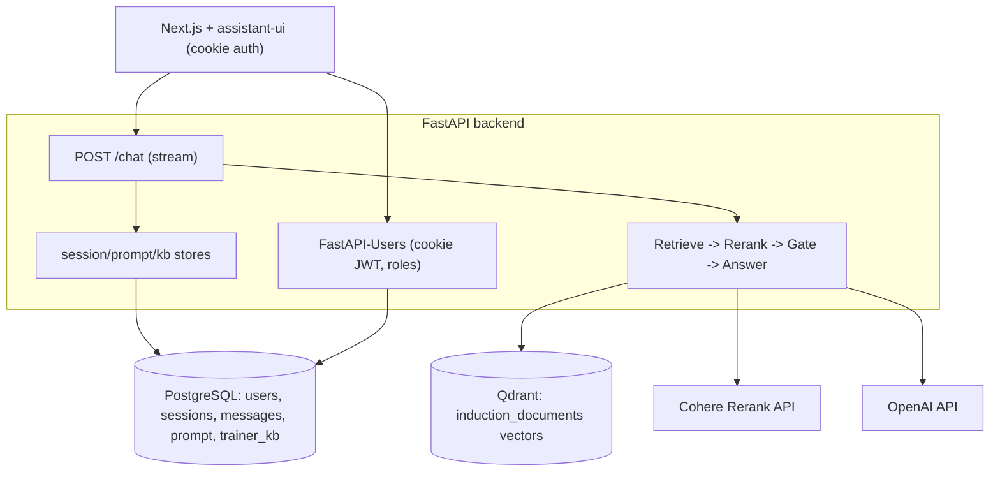

# Induction Chatbot — System Blueprint (M1)

Purpose of this document: enough detail that a capable agent (Opus 4.8) can reproduce the M1 system closely from scratch. It captures the product expectations, the bug we target (Bug1), the architecture, the data model, every endpoint, the retrieval pipeline with exact constants, and the frontend. Conventions: Python backend with readable code and NO code comments; numbered lists; one best choice per decision.

## 1. Product summary
A fast, concise, ChatGPT-like assistant for new Wimmera CMA employees. It answers strictly from a curated knowledge base (induction documents + trainer-added knowledge), keeps per-session and lightweight cross-session memory, cites its sources, and asks a clarifying question instead of guessing. Overriding requirement: reliability — never confidently answer when unsure.

## 2. M1 expectations (the contract)
1. Reliability is uncompromisable (budget may be spent for it).
2. Never guess / hallucinate; when unsure, say so or ask a clarifying question.
3. Simple registration/sign-in restricted to `@wcma.vic.gov.au` emails.
4. Users see their past sessions (ChatGPT-style thread list).
5. Remember past sessions in summarised form (lightweight).
6. Admin panel: view users + their conversations, reset passwords, promote to trainer.
7. Roles: basic and trainer (plus admin).
8. All users basic by default; admin can promote to trainer.
9. Trainer knowledge enters the KB two ways: an "Add to KB" button on a message, and trainer document upload (PDF/DOCX/TXT). Provenance stored; live immediately; admin can audit/remove.
10. Admin can view + edit the system prompt; saving reconfigures the bot at runtime.
11. Cite the source (document + section/page); say when an answer came from trainer-added knowledge.
12. Never answer on lexical match alone (Bug1).

## 3. Bug1 (the target failure) and the fundamental problem behind it
Asked whether a 12:00-12:30 lunch counts as time worked, the old chunk-RAG bot answered from the conditional Appendix C: Emergency Work (applies only under emergency activation) and missed the governing clause 23 (Rest Breaks / Meal Breaks). The EA is hierarchical: clause 23 (p.28), clause 24 Emergency Response (p.28), Appendix C (p.71). The fundamental problem is NOT emergency-specific: a clause's applicability (emergency-only, casual-only, probation-only, etc.) is set by its place in the heading hierarchy, which naive chunking severs from the chunk text. So no reranker or keyword can reliably know a chunk is conditional.

REJECTED FIX (do not reproduce): a keyword `detect_scope` matching "AIIMS/incident control" plus emergency-specific prompt lines. That only patches the one known case and is a hack.

CORRECT FIX: make every chunk carry its own structural context at ingestion (Anthropic Contextual Retrieval), plus grounded/verified generation, calibrated abstention, and an eval harness. See section 6.

## 4. Stack (pinned)
1. LLMs (two lanes, provider-agnostic via `app/llm_factory.py`): the **answer lane** writes the user-facing reply on the strongest model — Anthropic **Claude Opus 4.8** (`LLM_PROVIDER=anthropic`, `llama-index-llms-anthropic==0.11.4`); the **fast lane** runs every mechanical step (condense, query rewrite, applicability, verifier, ingest situating, session summary) on OpenAI `gpt-4o-mini`. Embeddings: OpenAI `text-embedding-3-small`. The fast lane is seedable/deterministic; Opus 4.8 rejects `temperature` and has no seed (adaptive thinking), so its retry variation comes from its own sampling — the factory registers Opus 4.8's context window and no-temperature behaviour at runtime so the pinned package works. Flip `LLM_PROVIDER=openai` to run everything on `gpt-4o-mini`.
2. Reranker: Cohere Rerank (`rerank-english-v3.0`), via `llama-index-postprocessor-cohere-rerank==0.9.0` + `cohere==6.1.0`. Chosen over a local cross-encoder because the prod backend container is capped at 512M; rerank compute is offloaded.
3. Vector store: Qdrant `v1.12.5`, collection `induction_documents`.
4. Relational DB: PostgreSQL 16, via SQLAlchemy `2.0.51` async + `asyncpg==0.31.0` (+ `greenlet`).
5. Auth: `fastapi-users[sqlalchemy]==15.0.5` (+ `fastapi-users-db-sqlalchemy==7.0.0`), cookie + JWT.
6. Backend: FastAPI `0.115.6`, uvicorn; `pydantic-settings`; `pymupdf` (PDF), `python-docx` (DOCX), `python-multipart` (uploads).
7. Frontend: Next.js 16 (App Router) + React 19 + assistant-ui (`@assistant-ui/react`), Tailwind v4.
8. Packaging: Docker + Docker Compose (services: app/backend, frontend, qdrant, postgres).

## 5. Architecture

Request flow for `/chat` (per turn):
1. Auth dependency resolves the current user from the cookie JWT (401 if absent).
2. Open an async DB session. Get-or-create the `ChatSession` by `(user_id, client_key)` where `client_key` is the frontend `session_id`.
3. Load that session's message history from Postgres into a list of LlamaIndex `ChatMessage`.
4. Build cross-session context = bullet list of OTHER sessions' summaries for this user (most recent 10).
5. Load the system prompt from DB config (falls back to the default).
6. Stream the answer (see pipeline), running the blocking generation in a threadpool (`starlette.concurrency.iterate_in_threadpool`) so the event loop is not blocked.
7. After streaming: persist the user + assistant messages; regenerate this session's summary (threadpool LLM call) and store it.

## 6. Reliability stack (the real fix) — four layers + measurement
This replaces the keyword-scope pipeline. Scope is solved at ingestion, generically.

### 6A. Knowledge representation
1. Structure-aware parsing: split by real structure — EA clause numbers (`23`, `23.1`, `Appendix C`) via regex on numbered headings; DOCX heading styles; strip page noise (`OFFICIAL`, running headers, `N of 79`). Record per unit: clause number, title, parent path, page.
2. Contextual chunking (keystone): for each chunk prepend (a) a deterministic breadcrumb (`EA 2024-2028 > 23. REST BREAKS / MEAL BREAKS > 23.3`) and (b) a 50-100 token LLM-written situating-context that states the chunk's scope/conditions, generated with the full document available (prompt-cached). This contextualised text is what gets embedded AND BM25-indexed.
3. Structured clause model for the EA: a table of clauses `{number, title, scope, parent, cross_refs}` so applicability is queryable data, not inferred. Populated at ingest from the parse + an LLM scope extraction.

### 6B. Retrieval
4. Hybrid: dense (Qdrant) + BM25 (keyword; catches exact refs like "23.3"), results fused.
5. Cohere cross-encoder rerank to top-k (the contextualised chunk text means the reranker now sees conditionality).
6. Expansion: from the structured clause model, add the full governing clause + any cross-referenced clauses so interactions are visible to the generator.

### 6C. Grounded generation
7. Generic scope/precedence prompt (NO hardcoded keywords): obey any condition stated in a passage's context; a conditional clause governs only if its condition is met; apply precedence (NES-overrides per EA clause 4.3; specific-over-general).
8. Span-grounded citations: every substantive claim anchored to a verbatim span + clause number.
9. Verifier pass (fast lane): a cheap second LLM call checks each claim is supported (map-authoritative for existence/coverage; source-required for substantive facts). It does NOT re-judge scope — it trusts the upstream applicability filter. Fail -> regenerate (different draft); still fail -> agentic re-retrieval then retry; still fail -> abstain.
10. Agentic re-retrieval (`stream_grounded_answer`): when no draft passes verification, the fast lane proposes a refined, concept-focused search query informed by what was already found, retrieves again, merges, and tries once more before abstaining — rescues hard/awkward questions instead of abstaining prematurely.
11. Calibrated abstention: the verifier verdict alone decides answer vs `UNSURE_RESPONSE` (the old hard rerank-confidence gate was removed). Never guess.

### 6D. Measurement and feedback
11. Eval harness (first-class deliverable): adversarial cases across scope, clause-interaction, scenario/computation (the 0-vs-30 case), out-of-scope (must abstain), citation-correctness; per-category pass rates; runs as a regression gate.
12. Observability: log retrieved clauses, scores, verifier verdicts per turn; flagged answers feed the eval set.
13. Trainer-content guard: trainer KB is scoped and still subject to grounding/verification; it cannot silently override authoritative clauses.

Constants (initial, tuned by the eval): dense top ~20, BM25 top ~20, rerank top ~8, situating-context 50-100 tokens. Honest residual: target is calibration not perfection; gold eval answers need human validation.

## 8b. Reliability updates since the initial build (Phase 1 & 2) — CURRENT behaviour
These were added after live testing and supersede any narrower description above. No case-specific fixes: each is a general mechanism.

### Bug2 — false abstention on coverage/enumeration questions
Symptom: a question the KB can clearly answer (e.g. follow-up "how many of them we got" after "tell me about leaves and breaks") returned the canned abstention most of the time (measured ~83% abstain). Root cause: the model correctly listed every leave type from the KB MAP, but the verifier graded each listed item against the RETRIEVED passages only and failed them as "not supported by source material". Fix: the KB MAP is authoritative for EXISTENCE / COVERAGE / ENUMERATION (what topics/sections exist, listing them, counting them) in BOTH generation and verification; SUBSTANTIVE policy facts (amounts, durations, eligibility, conditions) still REQUIRE retrieved source material; scope violations (Bug1) remain a hard fail. This removes false abstention without opening a hallucination hole, because the map carries only section titles, never rule content. Re-ingestion does NOT fix Bug2 — it is a verification-scope issue. Guiding principle (Arif): answer only accurately, but NEVER abstain on a question clearly answerable from the KB.

### KB map / outline (`app/rag/kb_outline.py`)
A compact structural map — each document and the topics/sections it covers — is injected into every chat turn as a system message, separate from the retrieved SOURCE MATERIAL. It is the model's authoritative answer source for coverage/overview/tour/"how many" questions, and the navigation aid for walkthroughs. It is built from the stored clause table (cached in process), so it reflects LLM-generated titles and works for poorly-structured documents. It is explicitly NOT a source of rule content.

### Bug1 second half — retrieval recall via query rewriting (`build_search_query` in `app/rag/chat.py`)
The applicability filter stops the bot ANSWERING from a conditional clause, but the governing GENERAL clause must still be retrieved. A user's casual scenario wording ("say i worked 8 AM - 4 PM, with lunch 12-12:30, does lunch count as worked hours?") embeds far from clause 23.2 while the emergency Appendix C is a near-lexical match, so 23.2 was never retrieved and the (correct) verifier abstained. Fix: an LLM rewrites the standalone question into a concept-focused search query (drops scenario noise, expands everyday terms like "lunch" -> "meal break"); dense+BM25 candidates are gathered for BOTH the original and the rewritten query, fused, then reranked against the true question. This is a standard general RAG technique, not a case fix.

### Structure-agnostic ingestion (Phase 2)
1. Generated titles: the situating LLM call also emits a short `TITLE:` for each unit; the effective title (the document's own heading if present, else the generated one) flows into the breadcrumb, chunk header, clause record, and the map. This means a document with no headings still yields usable section titles.
2. Fallback segmentation: if structure-aware PDF parsing yields zero units (an unstructured PDF), ingestion falls back to one unit per page so content is never silently dropped.
3. Richer breadcrumbs: sub-clauses now carry `parent > number generated-title` (e.g. `23. REST BREAKS / MEAL BREAKS > 23.2 Meal Break Policy`), which also improved retrieval recall.

### Determinism
Fast-lane (`gpt-4o-mini`) calls pass a fixed `seed` (via `additional_kwargs`) at `temperature=0` to cut run-to-run variance; the retry uses a different seed per attempt. Opus 4.8 (answer lane) cannot be seeded and rejects `temperature` (adaptive thinking), so the answer is non-deterministic — but determinism now matters most for the steps that SHAPE retrieval (condense, query rewrite, applicability, verifier), which all run on the seedable fast lane. This is a core reason for the hybrid split.

### Phase 3 — emergency-work questions + conversational polish (after second round of live testing)
1. Verifier no longer second-guesses scope. The applicability filter (`keep_applicable`) is the scope gate; it now KEEPS conditional content when the question is explicitly about that condition (e.g. "tell me about emergency work") and STRIPS it for ordinary-day questions. The verifier TRUSTS this — any conditional passage still in context was already deemed applicable — and only judges grounding + fabrication. This fixed false abstention on explicit emergency questions (Issue#1/#2) while Bug1 (ordinary-day) still holds.
2. Finer appendix segmentation (`app/kb/parse.py`, re-ingest required). Appendix C repeated its title as a per-page running header (split the appendix BY PAGE) and its sub-clauses used trailing dots (`1.5.`) that the SUB_CLAUSE regex rejected — so rules like clause 1.5 "meal intervals … counted as time worked" were buried in big multi-topic chunks and never retrieved. Fixes: accept trailing-dot sub-clauses; suppress a repeated appendix header (same appendix already open); treat numbered headings inside an appendix as sub-units of it. Appendix C went 15 coarse page-blobs → 66 fine sub-clause units; the map still rolls them up under one "Appendix C" entry via the breadcrumb root.
3. Topic-carrying condense (`CONDENSE_INSTRUCTION`). A bare situation/condition follow-up ("what would be the case during emergency work") now carries the prior topic forward ("During emergency work, does a meal break count as worked hours?") so retrieval finds the right clause — but ONLY when the follow-up has no topic of its own; a topic switch ("lets talk about the short tours") is left untouched.
4. Tour self-awareness (system prompt). The opening greeting is frontend-only and never reaches backend history, so the bot could not relate "the short tours" to its own offer. The prompt now makes the bot self-aware that it offers a guided tour, honoured even with no greeting in history (Issue#2.2).
5. Overview-first (system prompt). Broad open topics get a concise overview FIRST, then optionally one focused follow-up; never a clarifying-question-only reply (Issue#3).
6. Legible map (`render_outline`). The map is rendered one section per line (was one long semicolon string); the verifier intermittently failed to find real items (e.g. "Workplace Training Leave", §47) in the wall of text, causing flaky Bug2 abstention.

### Phase 4 — Opus 4.8 answer lane, hybrid split, agentic retrieval, real streaming
1. Provider-agnostic LLM (`app/llm_factory.py`). `make_llm(fast=?, attempt=?)` builds either lane. `LLM_PROVIDER`/`ANTHROPIC_CHAT_MODEL` pick the answer model (default Claude Opus 4.8); `FAST_LLM_PROVIDER`/`FAST_CHAT_MODEL` pick the fast model (default `gpt-4o-mini`). For Opus 4.8 the factory registers the model's context window and adds it to the no-temperature list (4.8 rejects `temperature`).
2. Hybrid model split. Opus 4.8 generates the answer; the fast lane runs condense, query rewrite, applicability, verifier, ingest situating and session summary. This restores reproducible retrieval and cut a clean turn from ~60–110s (everything on Opus) to ~8–11s to first token.
3. Applicability reworked to keep-by-default (`app/rag/applicability.py`). It now feeds the judge the provision's section **breadcrumb** (so terse/cryptic conditions like `'AIMS control system'` or `'non-casual employees'` resolve from their heading) and EXCLUDES a provision only when it clearly belongs to a special/different scenario than the question — fixing false drops of relevant clauses (e.g. clause 1.5, clause 36.1) that surfaced when the stricter fast model replaced Opus on this step. The per-condition judgments run CONCURRENTLY (one fast-lane call per unique condition), which alone cut prep latency ~7s.
4. Agentic re-retrieval (see 6C item 10).
5. Real streaming. `/chat` emits newline-delimited JSON frames: `{"t":"status"|"delta"|"reset"|"final","v":...}`. Status milestones show immediately; the Opus answer streams live as `delta`s; the verifier still GATES what stands — a draft that fails verification is `reset` (cleared) and replaced, so users never keep unverified content. `produce_grounded_answer` drives the same generator and returns only the final for non-streaming callers (eval/smoke/ask).

### Acceptance (current)
Eval harness `app/eval_harness.py`: 9/9 across scope (incl. Bug1 ordinary-day AND Issue#1 emergency-work meal break), out-of-scope, meta, overview, coverage (incl. a Bug2 case), tour. Smoke runner `app/smoke.py` replays Arif's verbatim cases from `.cursor/smokecases.md` end-to-end (Cases 1–6: overview/"how many"/overall-idea; guided tour; Bug1 lunch; Issue#1 emergency follow-up; Issue#2+#2.2 emergency-then-tour; Issue#3 broad topic). Issue#1 measured 6/6 correct (answers "counted as time worked, clause 1.5"). Re-ingest produces ~385 chunks / ~368 clauses.

## 9. Memory model
- Within a session: full message history loaded from Postgres each turn (not an in-process buffer).
- Cross-session (lightweight): each `ChatSession` has a `summary` (2-3 sentences), regenerated after each turn from the running transcript. On a new turn, the other sessions' summaries are concatenated and injected as a system message labelled as background context that must not override the source passages.

## 10. Data model (PostgreSQL, tables created via SQLAlchemy `create_all` on startup)
- `user` (FastAPI-Users base UUID table) + extra columns: `full_name: str`, `role: str` (`basic`|`trainer`|`admin`, default `basic`), `profile_summary: text`.
- `chat_session`: `id uuid pk`, `user_id uuid fk user.id`, `client_key str`, `title str`, `summary text`, `created_at`, `updated_at`; unique `(user_id, client_key)`.
- `chat_message`: `id uuid pk`, `session_id uuid fk chat_session.id`, `role str` (`user`|`assistant`), `content text`, `created_at`.
- `system_prompt_config`: single row `id=1`, `prompt text`, `updated_at`. Seeded with the default prompt on startup.
- `trainer_kb_entry`: `id uuid pk`, `trainer_id uuid fk user.id`, `trainer_name str`, `kind str` (`message`|`document`), `source_label str`, `filename str`, `content text`, `created_at`.

## 11. Auth (`app/auth.py`, `app/schemas.py`, `app/seed_admin.py`)
1. FastAPI-Users with `SQLAlchemyUserDatabase`. JWT strategy, `CookieTransport` (httpOnly, SameSite=Lax, `cookie_secure` from env), token lifetime 7 days.
2. Registration domain restriction: `UserManager.create` rejects emails whose domain != `ALLOWED_EMAIL_DOMAIN` (`wcma.vic.gov.au`) with 400.
3. Role guards: `current_active_user`; `require_roles(*roles)` returns a dependency that always allows `admin`, else requires membership; `current_trainer = require_roles("trainer")`, `current_admin = require_roles("admin")`.
4. Admin seed: `python -m app.seed_admin` creates/ensures an admin from `ADMIN_EMAIL`/`ADMIN_PASSWORD` (sets `role=admin`, `is_superuser=True`).
5. Password hashing: argon2 via FastAPI-Users `PasswordHelper` (used for admin reset).

## 12. Trainer KB ingestion (`app/trainer_kb.py`, `app/kb_store.py`)
1. `POST /kb/text` (trainer): create a `trainer_kb_entry` (kind=message, source_label="Trainer note by {name}"), then embed the text into Qdrant.
2. `POST /kb/document` (trainer): read upload, extract text (PDF via PyMuPDF stream, DOCX via python-docx BytesIO, TXT decode; else 400), create entry (kind=document, source_label=filename), embed.
3. Embedding: build a LlamaIndex `Document` with `id_ = kb_entry_id` and metadata `{source, origin:"trainer", trainer, scope, kb_entry_id}`, chunk with `SentenceSplitter(700/150)`, `index.insert_nodes(nodes)`. Using `id_` as ref_doc_id lets admin removal delete the entry's vectors via `vector_store.delete(ref_doc_id)`.
4. Blocking embed/extract calls run in a threadpool from the async endpoints.

## 13. Endpoints (all browser calls send `credentials: "include"`)
- Auth: `POST /auth/register`, `POST /auth/jwt/login` (form: username,password), `POST /auth/jwt/logout`, `POST /auth/forgot-password`, `POST /auth/reset-password`; `GET /users/me`.
- Chat (login required): `POST /chat` `{session_id, message}` (newline-delimited JSON stream, `application/x-ndjson`; frames `{"t":"status"|"delta"|"reset"|"final","v":...}`); `GET /sessions`; `GET /sessions/{id}/messages`.
- Trainer: `POST /kb/text` `{content}`; `POST /kb/document` (multipart `file`).
- Admin: `GET|PUT /admin/prompt`; `GET /admin/users`; `POST /admin/users/{id}/role` `{role}`; `POST /admin/users/{id}/reset-password` `{new_password}`; `GET /admin/users/{id}/sessions`; `GET /admin/users/{id}/sessions/{sid}/messages`; `GET /admin/kb`; `DELETE /admin/kb/{id}`.
- `GET /health`.
- CORS: allow the frontend origin with `allow_credentials=True`.

## 14. Backend file map
- `app/config.py`: pydantic-settings (llm_provider + Anthropic key/model, fast_llm_provider + fast_chat_model, OpenAI/Cohere keys + models, qdrant, documents_dir, frontend_origin, database_url, jwt_secret, cookie_secure, allowed_email_domain, admin_email/password).
- `app/llm_factory.py`: provider-agnostic LLM builder — `make_llm(fast=?, attempt=?)`; answer lane (Opus 4.8) vs fast lane (`gpt-4o-mini`); registers Opus 4.8 context window + no-temperature at runtime.
- `app/db.py`: async engine, `async_session_maker`, `Base`, `create_db_and_tables`, `get_async_session`.
- `app/models.py`: User + ChatSession + ChatMessageRecord + SystemPromptConfig + TrainerKBEntry; role + kind constants.
- `app/auth.py`, `app/schemas.py`, `app/seed_admin.py`: auth.
- `app/rag/engine.py`: configures LlamaIndex LLM + embeddings + Qdrant vector store (`check_compatibility=False`).
- `app/rag/retrieval.py`: dense (Qdrant) + BM25 candidate gathering across multiple queries, fuse/dedup, Cohere rerank, `Passage` model.
- `app/rag/chat.py`: default system prompt (map+source authority, scope/precedence), condense, `build_search_query` (query rewrite), `build_refined_search_query` (agentic refine), `generate_answer` + `generate_answer_stream` (live token streaming), verifier (map-authoritative for existence/coverage), `build_llm` (answer lane) / `build_fast_llm` (fast lane), citation labels, `summarise_conversation`.
- `app/rag/pipeline.py`: `stream_grounded_answer` (async generator yielding status/delta/reset/final frames; agentic re-retrieval) and `produce_grounded_answer` (drives it, returns the final) — the single answer path used by `/chat`, `app.ask`, `app.smoke`, and the eval harness.
- `app/rag/applicability.py`: async applicability filter — keep-by-default; excludes a conditional passage only when it clearly belongs to a different scenario; uses the section breadcrumb for context; per-condition judgments run concurrently (primary Bug1 guard).
- `app/rag/expansion.py`: expands retrieved clauses with sibling + cross-referenced clauses from the clause table.
- `app/rag/kb_outline.py`: builds the KB MAP from the clause table (cached); authoritative for coverage/overview/tour/"how many".
- `app/kb/parse.py`: structure-aware PDF/DOCX parsing (merges split top-level headings; per-page fallback for unstructured PDFs).
- `app/kb/contextual.py`: situating LLM call (prose + scope + generated TITLE), effective title/breadcrumb, contextual chunking.
- `app/kb/clause_model.py`: builds clause records (effective title/breadcrumb, cross-refs) for the clause table.
- `app/kb/bm25_index.py`: on-disk BM25 corpus in `kb_index/`.
- `app/kb/ingest_kb.py`: full ingest — parse -> situate/chunk -> embed to Qdrant + save BM25 + persist clause table. Run as `python -m app.kb.ingest_kb`.
- `app/kb/store_clauses_from_corpus.py`: cheap clause-table rebuild from the saved BM25 corpus (no LLM cost).
- `app/chat_store.py`, `app/config_store.py`, `app/kb_store.py`, `app/admin_store.py`: async DB helpers.
- `app/trainer_kb.py`: upload extraction + KB embed/remove.
- `app/main.py`: app wiring, lifespan (create tables + seed prompt), routers, all endpoints; `/chat` calls `produce_grounded_answer`.
- `app/eval_harness.py`: adversarial eval (scope/out-of-scope/meta/overview/coverage(incl. Bug2)/tour), regression gate.
- `app/smoke.py`: replays Arif's three verbatim smoke cases end-to-end.
- `app/ask.py`: CLI for ad-hoc questions (uses the shared pipeline).
- Removed: `app/ingest.py` and `app/regression.py` (superseded by `app/kb/ingest_kb.py` and `app/eval_harness.py`).

## 15. Frontend (Next.js App Router)
- `lib/api.ts`: API base + all fetch wrappers (always `credentials:"include"`); login posts form-urlencoded.
- `lib/trainer-context.tsx`: `TrainerProvider`/`useCanTrain` to gate trainer UI.
- `app/login/page.tsx`: login/register (domain hint), redirects to `/` on success.
- `app/assistant.tsx`: auth gate (`/users/me`, else redirect to `/login`); custom sidebar listing `/sessions` (new chat + reload history); a keyed `ChatPane` building `useLocalRuntime` with a streaming adapter to `/chat` that parses newline-delimited JSON frames (status shown as muted italics until the answer starts streaming; delta appends; reset clears an unverified draft; final commits); trainer doc-upload; logout; admin link.
- `components/thread.tsx`: assistant-ui thread; `AddToKbButton` on user messages (trainer-only) posts `/kb/text`.
- `app/admin/page.tsx`: admin-gated panel (users table with role select + reset password + view chats; system prompt editor; KB entries list + delete).
- Citations: rendered inline in the assistant's markdown answer (the model writes the labels); no separate citations widget in M1.

## 16. Environment variables
`LLM_PROVIDER` (default openai; set `anthropic` for Opus), `ANTHROPIC_API_KEY`, `ANTHROPIC_CHAT_MODEL` (default claude-opus-4-8), `FAST_LLM_PROVIDER` (default openai), `FAST_CHAT_MODEL` (default gpt-4o-mini), `OPENAI_API_KEY`, `OPENAI_CHAT_MODEL` (default gpt-4o-mini), `OPENAI_EMBEDDING_MODEL`, `COHERE_API_KEY`, `COHERE_RERANK_MODEL` (rerank-english-v3.0), `QDRANT_URL`, `QDRANT_COLLECTION` (induction_documents), `DOCUMENTS_DIR`, `FRONTEND_ORIGIN`, `DATABASE_URL` (postgresql+asyncpg://...), `JWT_SECRET`, `COOKIE_SECURE` (true in prod), `ALLOWED_EMAIL_DOMAIN` (wcma.vic.gov.au), `ADMIN_EMAIL`, `ADMIN_PASSWORD`. Frontend: `NEXT_PUBLIC_API_URL`.

## 17. Build / run / deploy
Local: `docker compose up -d postgres qdrant`; `pip install -r requirements.txt`; `python -m app.kb.ingest_kb`; `python -m app.seed_admin`; `uvicorn app.main:app`; `cd frontend && npm install && npm run dev`.
Verify reliability: `python -m app.eval_harness` (expect 9/9) and `python -m app.smoke` (Arif's verbatim cases). Install adds `llama-index-llms-anthropic`; set `LLM_PROVIDER=anthropic` + `ANTHROPIC_API_KEY` to use Opus 4.8.
Deploy (AWS EC2, Docker, behind nginx/SSL): add a Postgres service to the server compose, set all env, route ALL backend API paths (`/auth/*`, `/users/*`, `/sessions/*`, `/kb/*`, `/admin/*`, `/chat`) to the backend, then one-off `seed_admin` + `ingest`. See `handover.md` for server specifics.

## 18. Milestone 2 (out of scope for M1, noted for the reproducer)
Auto-refresh ingestion on document upload (change-detection) and robust retrieval for a large KB (hierarchical/structured retrieval) — the reranker pipeline here is the M1-sized step on that path.
